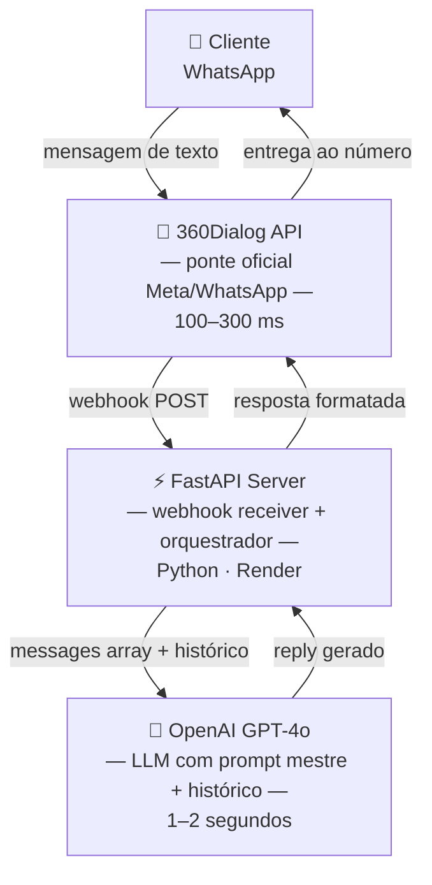

<div align="center">


<br/>

[](https://linkedin.com/in/luisotavioguero)
[](https://github.com/zyzerkk)
[](mailto:contatoguero@gmail.com)
[](#)
[](https://github.com/zyzerkk)

</div>

---

## 🧩 Tecnologias & Ferramentas

<div align="center">


</div>

---

```python
#!/usr/bin/env python3

class LuísOtávioGuero:
    nome      = "Luís Otávio Guero"
    idade     = 22
    local     = "Santa Maria, RS — Brasil"
    formação  = [
        "Engenharia Aeroespacial · UFSM            (2023 – presente)",
        "Engenharia de Software  · UNICESUMAR       (2022 – 2023)",
        "TI + Eletrotécnica      · SESI SENAI       (2019 – 2021)",
    ]
    linguagens = ["Python", "C++", "TypeScript", "JavaScript", "SQL", "C"]
    áreas      = [
        "Sistemas Embarcados & CubeSat",
        "Banco de Dados & Migração",
        "Automação & IA Aplicada",
        "Testes E2E Automatizados",
        "RF & Comunicação por Rádio Frequência",
        "Backend APIs (FastAPI / Node.js)",
        "Physics-ML & PINNs (NVIDIA PhysicsNeMo)",
    ]
    idiomas    = {"Português": "nativo", "Inglês": "avançado (lê, escreve, fala)"}
    frase      = "Resolvo problemas reais com código real."
```

---

## 📊 GitHub Stats

<div align="center">


</div>

<div align="center">

<sub>Gerado automaticamente pelo workflow <code>.github/workflows/metrics.yml</code> deste repositório — calendário isométrico de commits do ano + linguagens mais usadas por atividade real.</sub>

</div>

---
---

<div align="center">

# 🕓 Linha do Tempo

### Trajetória técnica, acadêmica e de projetos — em ordem cronológica

</div>

---

## 🎓 2019 – 2021 · Formação Técnica

**SESI SENAI** — Técnico em TI + Eletrotécnica

Base técnica em eletrônica, lógica de programação e infraestrutura, que sustentou toda a atuação posterior em sistemas embarcados e desenvolvimento de software.

**Premiações do período:**

| Medalha | Competição | Ano |
|:---:|:---|:---:|
| 🥉 Bronze | Copa Brasileira Mangahigh (Matemática) | 2019 |
| 🥇 Ouro | MOBFOG — Mostra Brasileira de Foguetes | 2020 |
| 🥇 Ouro | Copa Brasileira Mangahigh (Matemática) | 2020 |
| 🥇 Ouro | MOBFOG — Mostra Brasileira de Foguetes | 2021 |
| 🥉 Bronze | Olimpíada de Foguetes Sólidos | 2021 |
| 🥉 Bronze | Olimpíada Canguru de Matemática | 2021 |

---

## 💼 2021 – presente · Zucchetti Software e Sistemas

**Suporte Técnico N1 → N3** · `+4 anos`

Iniciei no N1 e em **6 meses fui convidado a criar e liderar a equipe N2**. Promovido a **N3** pela capacidade de resolver problemas críticos que demandavam conhecimento profundo de banco de dados, comportamento de sistema e debugging avançado.

**Responsabilidades N3:**
- Correção de bugs em sistemas de gestão fiscal (ERP)
- Restauração de bancos de dados corrompidos via IBExpert
- Reparos em tabelas e índices no Firebird (FDB)
- Análise de logs e relatórios técnicos para diagnóstico de falhas
- Liderança técnica do time N2

**Especialidade — Migração e Conversão de Banco de Dados** `6 meses dedicados`:

```sql
-- Pipeline de migração desenvolvido e executado em produção

-- 1. FDB → FDB: reestruturação de schema sem perda de dados
BACKUP DATABASE 'origem.fdb' TO 'backup.fbk';
RESTORE DATABASE 'backup.fbk' TO 'destino.fdb' PAGE_SIZE 8192;

-- 2. PostgreSQL → FDB: conversão de tipos e charset
-- PSQL uuid → FDB CHAR(36), PSQL jsonb → FDB BLOB SUB_TYPE TEXT

-- 3. CSV → FDB: importação massiva com validação
-- Limpeza de encoding (UTF-8/latin-1), normalização de datas

-- 4. MySQL → FDB: mapeamento de engines e collations
-- AUTO_INCREMENT → BEFORE INSERT trigger + NEXT VALUE FOR gen

-- 5. GDB → FDB: atualização de versão Firebird
```

**Ferramentas dominadas:** IBExpert · DB Visualizer · SQL Server · MySQL Workbench · MongoDB Compass · pgAdmin

---

## 🥇 2022 · OBSAT — Fase Regional

CubeSat meteorológico da **Equipe Halley**, classificado em 1° lugar na etapa regional do OBSAT, iniciando o desenvolvimento que culminaria no lançamento sub-orbital de 2023.

---

## 🎓🛰️ 2023 · UFSM, GEDRE e Lançamento do CubeSat

### Engenharia Aeroespacial — UFSM
Início da graduação em Engenharia Aeroespacial, atual foco acadêmico.

### UFSM — GEDRE (Grupo de Estudos de Reatores Eletrônicos)
`junho – dezembro 2023`

Programador Python no projeto **Visible Light Communication com IA** — sistema que utiliza inteligência artificial para manipular comunicação por luz visível (VLC), usando o **NVIDIA Modulus** (framework de Physics-ML, hoje renomeado para PhysicsNeMo) para modelagem física.

```python
# Ambiente configurado: NVIDIA Modulus via Google Colab
# VSCode não tinha suporte para as dependências — migração necessária

# Clone do repositório Modulus (GitLab Nvidia)
# !git clone https://<user>:<token>@gitlab.com/nvidia/modulus/modulus.git

# Desafios enfrentados e resolvidos:
# 1. Link GitLab da Nvidia desativado → busca em fóruns e comunidades
# 2. Incompatibilidade de versão Python no Colab → downgrade controlado
# 3. Instalação de dependências a partir de fontes alternativas verificadas

# Stack: Python · C++ · NVIDIA Modulus (Physics-ML) · Google Colab GPU
```

### 🛰️ OBSAT — CubeSat Meteorológico · Equipe Halley

<div align="center">


</div>

Capitão, programador e desenvolvedor estrutural de um **CubeSat meteorológico** para detecção antecipada de tornados e ciclones tropicais em Santa Catarina. Projeto desenvolvido do zero, sem conhecimento prévio, evoluindo por 4 fases até o lançamento sub-orbital real em Natal/RN, dezembro de 2023.

**Arquitetura do sistema:**

| Subsistema | Tecnologia | Especificação |
|:---|:---|:---|
| Computador de Bordo | PION Labs (C++) | Orquestra todos os módulos |
| Comunicação RF | LoRa 433 MHz · Helicoidal | 30 dBi · 100mm · 280g |
| Posicionamento | GPS + TinyGPS++ | Lat, Long, Alt, Velocidade em tempo real |
| Sensoriamento | C++/Arduino IDE | Temp, Pressão, CO₂, Acelerômetro XYZ, Giroscópio XYZ |
| Armazenamento | Cartão SD duplo (backup) | CSV organizado + backup redundante |
| Estrutura | Alumínio Aeronáutico 7075 | 100×100×100 mm · 420 g · Etaflon térmico |

<details>
<summary><b>Ver código embarcado — telemetria, CSV e RF LoRa</b></summary>

```cpp
#include "PION_System.h"
#include <WiFi.h>
#include <HTTPClient.h>
#include "FS.h"
#include <PION_Storage.h>
#include <ArduinoJson.h>
#include <SoftwareSerial.h>
#include <HardwareSerial.h>
#include <TinyGPS++.h>

#define NETWORK_SERVER "https://obsat.org.br/teste_post/envio.php"
#define TEAM_NUM       "15"
#define RXD2           16
#define BTN1            4
#define BTN2            5
#define LED1            4

TinyGPSPlus gps;
SoftwareSerial loraSerial(2, 3); // TX, RX — Transmissor RF LoRa

void conectarWifi() {
  WiFi.begin("SSID", "SENHA");
  while (WiFi.status() != WL_CONNECTED) { delay(500); }
  Serial.println("WiFi conectada. IP: " + WiFi.localIP().toString());
}

void loop() {
  DynamicJsonDocument jsonBuffer(512);
  jsonBuffer["equipe"]      = TEAM_NUM;
  jsonBuffer["bateria"]     = cubeSat.getBattery();
  jsonBuffer["temperatura"] = cubeSat.getTemperature();
  jsonBuffer["pressao"]     = cubeSat.getPressure();
  jsonBuffer["umidade"]     = cubeSat.getHumidity();
  jsonBuffer["co2"]         = cubeSat.getCO2Level();

  JsonArray accel = jsonBuffer.createNestedArray("acelerometro");
  accel.add(cubeSat.getAccelerometer(0)); // X
  accel.add(cubeSat.getAccelerometer(1)); // Y
  accel.add(cubeSat.getAccelerometer(2)); // Z

  JsonArray gyro = jsonBuffer.createNestedArray("giroscopio");
  gyro.add(cubeSat.getGyroscope(0));
  gyro.add(cubeSat.getGyroscope(1));
  gyro.add(cubeSat.getGyroscope(2));

  // GPS payload
  while (Serial1.available()) {
    char cIn = Serial1.read();
    gps.encode(cIn);
    payload.add("Altitude: "  + String(gps.altitude.meters()));
    payload.add("Latitude: "  + String(gps.location.lat(), 4));
    payload.add("Longitude: " + String(gps.location.lng(), 4));
    payload.add("Velocidade: "+ String(gps.speed.kmph()));
  }
}
```

**Organização do CSV no Cartão SD:**

```cpp
void createFileFirstLine(fs::FS &fs, const char *path) {
  File file = fs.open(path, FILE_WRITE);
  const char *header = "Data,Hora,temperatura(C),Pressao,"
                       "umidade(%),co2(ppm),Acelerometro,"
                       "Giroscopio,bateria(%),Payload";
  if (file.println(header)) Serial.println("Escrita começou");
  else                       Serial.println("Falha na escrita");
  file.close();
}
```

**Programação RF LoRa — Transmissor e Receptor:**

```cpp
// === TRANSMISSOR ===
SoftwareSerial loraSerial(2, 3); // TX, RX
void setup() {
  pinMode(BTN1, INPUT_PULLUP);
  pinMode(BTN2, INPUT_PULLUP);
  Serial.begin(9600);
  loraSerial.begin(9600);
}
void loop() {
  if (digitalRead(BTN1) == 0) {
    loraSerial.print("on");
    while (digitalRead(BTN1) == 0) { delay(50); }
  }
  if (digitalRead(BTN2) == 0) {
    loraSerial.print("off");
    while (digitalRead(BTN2) == 0) { delay(50); }
  }
}

// === RECEPTOR ===
void loop() {
  if (loraSerial.available() > 1) {
    String input = loraSerial.readString();
    Serial.println(input);
    if (input == "on")  { digitalWrite(LED1, HIGH); }
    if (input == "off") { digitalWrite(LED1, LOW);  }
    delay(20);
  }
}
```

</details>

**Dados reais coletados em missão (amostra do CSV):**

| Equipe | Bateria (%) | Temp (°C) | Pressão (Pa) | CO₂ (ppm) | Acelerômetro XYZ | Status |
|:---:|:---:|:---:|:---:|:---:|:---:|:---:|
| 15 | 64 | 15.68 | 93635.13 | 2265.00 | X=−0.89 Y=0.06 Z=−9.55 | ✅ Sucesso |
| 15 | 64 | 15.67 | 93953.14 | 50.67 | X=−0.94 Y=0.06 Z=−9.55 | ✅ Sucesso |
| 15 | 65 | 17.83 | 93619.21 | 12.59 | X=−0.48 Y=0.04 Z=−9.64 | ✅ Sucesso |

**Testes de qualificação realizados:**

| Teste | Condição | Resultado |
|:---|:---|:---:|
| ❄️ Criogênico | Gelo seco → −33.33 °C | ✅ Nenhum dano |
| 🔥 Térmico | Secador → +50.65 °C | ✅ Nenhum dano |
| 🌌 Vácuo | 946 mbar → 6 mbar por 120s (parceria BRF) | ✅ Aprovado |
| 📳 Vibração | Simulação shaker, 5 repetições | ✅ Estrutura intacta |
| 🧲 Magnético | Magnetômetro x:−25.7 y:80.7 µT | ✅ Funcional |
| 💡 Luminosidade | 0% → 102% | ✅ Sensor calibrado |
| 🎈 Voo | Balão atmosférico ~40 km de altitude | ✅ Satélite ativo |

**Antena selecionada: Helicoidal** — 433 MHz · 30 dBi · 280g · 100mm altura × 66mm diâmetro

<details>
<summary><b>Ver estudo completo de seleção de antena</b></summary>

**Razão da escolha:**

| | Critério |
|:---:|:---|
| ✅ | Alta direcionalidade para comunicação com estação terrestre |
| ✅ | Alto ganho para longas distâncias (sub-órbita → terra) |
| ✅ | Tamanho compacto compatível com CubeSat 1U |
| ⚠️ | Trade-off: sensível a variações de frequência e frágil a vibrações → **mitigado com isolamento estrutural** |

**Alternativas avaliadas e descartadas:**

| Antena | Vantagens | Motivo do Descarte |
|:---|:---|:---|
| Dipolo | Omnidirecional, ganho médio, simples | ❌ Ganho insuficiente |
| Patch | Baixo perfil, leve, fácil fabricação | ❌ Banda estreita |
| Monopolo | Design simples, omnidirecional | ❌ Baixo ganho |

</details>

---

## 🤖 2024 · Automação de Atendimento via WhatsApp com IA

Consultoria e desenvolvimento de backend Python que conecta WhatsApp Business a um LLM via API oficial, com sistema de memória contextual, fluxos de atendimento e deploy em produção.

**Arquitetura do sistema:**



<details>
<summary><b>Ver código do webhook FastAPI</b></summary>

```python
from fastapi import FastAPI, Request
from openai import OpenAI
import httpx, json

app    = FastAPI()
client = OpenAI(api_key="...")

# Histórico por número de telefone (memória contextual)
historico: dict[str, list] = {}

@app.post("/webhook")
async def receber_mensagem(req: Request):
    body = await req.json()
    numero  = body["from"]
    texto   = body["text"]["body"]

    if numero not in historico:
        historico[numero] = [{"role": "system", "content": PROMPT_MESTRE}]

    historico[numero].append({"role": "user", "content": texto})

    resposta = client.chat.completions.create(
        model    = "gpt-4o",
        messages = historico[numero],
    )
    reply = resposta.choices[0].message.content
    historico[numero].append({"role": "assistant", "content": reply})

    await enviar_whatsapp(numero, reply)
    return {"status": "ok"}

async def enviar_whatsapp(numero: str, mensagem: str):
    async with httpx.AsyncClient() as http:
        await http.post(
            "https://waba.360dialog.io/v1/messages",
            headers={"D360-API-KEY": "..."},
            json={"to": numero, "type": "text", "text": {"body": mensagem}},
        )
```

</details>

**Entregáveis (6 semanas):** levantamento de requisitos · backend + webhook · prompt mestre · fluxos de atendimento · deploy Render · documentação técnica · treinamento da equipe

---

## 🧪 2024 · Testes E2E Automatizados — Meta Pixel + Checkout

Suite Playwright que abre o link do criativo do anúncio, scrolla a página, clica nos botões e preenche o checkout automaticamente — validando cada evento do Meta Pixel interceptando as requisições HTTP em tempo real.

<div align="center">

</div>

**Cobertura:**

```
✓ PageView            — pixel inicializado e disparado
✓ InitiateCheckout    — evento ao clicar no CTA
✓ Scroll comportamental — simula usuário real
✓ Preenchimento checkout — todos os campos
✓ Smoke: fbq() presente — pixel carregado
✓ Smoke: zero erros de console
✓ Desktop (Chrome) + Mobile (iPhone 14)
```

<details>
<summary><b>Ver código do teste Playwright</b></summary>

```typescript
// tests/meta-ads-checkout.spec.ts
import { test, expect, Page } from '@playwright/test'

const AD_URL        = 'https://seusite.com/lp/produto'
const META_PIXEL_ID = 'SEU_PIXEL_ID'

test('jornada completa: criativo → scroll → CTA → checkout', async ({ page }) => {
  const eventos: string[] = []

  page.on('request', (req) => {
    const url = req.url()
    if (url.includes('facebook.com/tr/') && url.includes(META_PIXEL_ID)) {
      const ev = new URLSearchParams(url.split('?')[1] ?? '').get('ev')
      if (ev) {
        eventos.push(ev)
        console.log(`✓ Pixel event: ${ev}`)
      }
    }
  })

  await page.goto(AD_URL, { waitUntil: 'networkidle' })
  await page.waitForTimeout(2000)
  expect(eventos).toContain('PageView')

  await page.evaluate(() =>
    window.scrollBy({ top: window.innerHeight * 0.3, behavior: 'smooth' })
  )
  await page.waitForTimeout(700)
  await page.evaluate(() =>
    window.scrollBy({ top: window.innerHeight * 0.5, behavior: 'smooth' })
  )
  await page.waitForTimeout(700)

  const cta = page.locator('button:has-text("Comprar"), [data-cta], a:has-text("Quero")').first()
  await cta.scrollIntoViewIfNeeded()
  await page.waitForTimeout(500)
  await cta.click()

  await page.waitForURL(/checkout|cart/, { timeout: 8000 }).catch(() => {})
  await page.waitForTimeout(2000)
  expect(eventos).toContain('InitiateCheckout')

  const fill = async (sel: string, val: string) => {
    const el = page.locator(sel).first()
    if (await el.isVisible().catch(() => false)) await el.fill(val)
  }

  await fill('input[name*="nome"], input[placeholder*="nome"]', 'Teste Automatizado')
  await fill('input[type="email"]',                             'qa@teste.com')
  await fill('input[name*="cpf"], input[placeholder*="CPF"]',  '000.000.000-00')
  await fill('input[name*="card"]',                            '4111111111111111')
  await fill('input[name*="expiry"]',                          '12/30')
  await fill('input[name*="cvv"]',                             '123')

  await page.screenshot({ path: 'tests/evidencias/checkout.png', fullPage: true })

  console.log('\n── Eventos capturados ──')
  eventos.forEach(ev => console.log(`  • ${ev}`))

  expect(eventos).toContain('PageView')
  expect(eventos).toContain('InitiateCheckout')
})

test('smoke — pixel fbq existe na página', async ({ page }) => {
  await page.goto(AD_URL, { waitUntil: 'networkidle' })
  const loaded = await page.evaluate(() => typeof (window as any).fbq === 'function')
  expect(loaded).toBe(true)
})

test('smoke — sem erros críticos de console', async ({ page }) => {
  const erros: string[] = []
  page.on('console', m => { if (m.type() === 'error') erros.push(m.text()) })
  await page.goto(AD_URL, { waitUntil: 'networkidle' })
  const criticos = erros.filter(e => !e.includes('favicon') && !e.includes('ERR_BLOCKED'))
  expect(criticos.length).toBe(0)
})
```

</details>

---

## 🧠 2025 – presente · NVIDIA PhysicsNeMo — Artigo sobre PINNs

**Status: material preliminar em preparação** · Foco: aplicação de **Physics-Informed Neural Networks (PINNs)** com o framework **NVIDIA PhysicsNeMo** (antigo NVIDIA Modulus) em um problema de engenharia específico.

> Este projeto é independente do trabalho anterior no GEDRE/UFSM com o Modulus — trata-se de uma nova frente de estudo, já sobre o framework rebatizado, com foco direcionado em PINNs.

**O que já foi preparado até agora:**

| Etapa | Status |
|:---|:---:|
| Levantamento teórico sobre PINNs e a atualização Modulus → PhysicsNeMo | ✅ Concluído |
| Setup do ambiente de desenvolvimento com PhysicsNeMo | ✅ Concluído |
| Primeiros testes de treinamento do modelo PINN | ✅ Concluído |
| Resultados e gráficos preliminares | ✅ Obtidos |
| Consolidação dos resultados em formato de artigo técnico | 🟠 Em andamento |
| Definição de recorte final do problema físico abordado | 🟠 Em refinamento |
| Submissão / publicação do artigo | ⏳ Próximo passo |

```python
# Migração de nomenclatura oficial (release recente da NVIDIA):
# import modulus         →  import physicsnemo

# Escopo do estudo: Physics-Informed Neural Networks (PINNs)
# aplicadas a um problema de engenharia específico, treinando
# a rede diretamente sobre restrições de EDPs/EDOs do sistema
# físico modelado — com resultados preliminares já obtidos
# e em fase de consolidação para publicação.
```

**Próximos passos:** finalizar a consolidação dos resultados preliminares, revisar a literatura recente sobre PINNs no PhysicsNeMo, e estruturar o artigo técnico completo para submissão.

---

<div align="center">

---

</div>

## 🏆 Premiações — Resumo Geral

| Medalha | Competição | Período | Contexto |
|:---:|:---|:---:|:---|
| 🥇 Ouro | OBSAT — Regional e Nacional | 2022 · 2023 | CubeSat · lançamento sub-orbital CLBI/RN |
| 🥇 Ouro | MOBFOG | 2020 · 2021 | Mostra Brasileira de Foguetes |
| 🥉 Bronze | Olimpíada de Foguetes Sólidos | 2021 | — |
| 🥉 Bronze | Olimpíada Canguru de Matemática | 2021 | — |
| 🥇 Ouro | Copa Brasileira Mangahigh | 2020 | Matemática |
| 🥉 Bronze | Copa Brasileira Mangahigh | 2019 | Matemática |

---

<details>
<summary><b>⚙️ Como este README gera as métricas automaticamente (Metrics Action)</b></summary>
<br/>

Este perfil usa a [GitHub Action oficial do `lowlighter/metrics`](https://github.com/lowlighter/metrics), rodando dentro do próprio repositório `zyzerkk/zyzerkk`. O Action gera o arquivo `github-metrics.svg` via commit automático (cron diário), e o README apenas exibe esse arquivo — sem depender de nenhum serviço externo. Apenas dois plugins ativos, conforme solicitado: calendário 3D de commits do ano e linguagens mais usadas.

```yaml
# .github/workflows/metrics.yml
name: metrics
on:
  workflow_dispatch:
  schedule:
    - cron: "0 6 * * *"   # atualiza diariamente às 06h

jobs:
  github-metrics:
    runs-on: ubuntu-latest
    permissions:
      contents: write
    steps:
      - uses: lowlighter/metrics@latest
        with:
          token: ${{ secrets.METRICS_TOKEN }}
          base: ""
          plugin_isocalendar: yes
          plugin_isocalendar_duration: full-year
          plugin_languages: yes
          plugin_languages_limit: 6
          plugin_languages_threshold: 0%
```

`METRICS_TOKEN` é um Personal Access Token **clássico** (não fine-grained) com escopo `repo` + `read:user`, salvo como secret do repositório.

</details>

---

<div align="center">


`contatoguero@gmail.com` · `Santa Maria, RS · Brasil` · [`linkedin.com/in/luisotavioguero`](https://linkedin.com/in/luisotavioguero)

</div>
